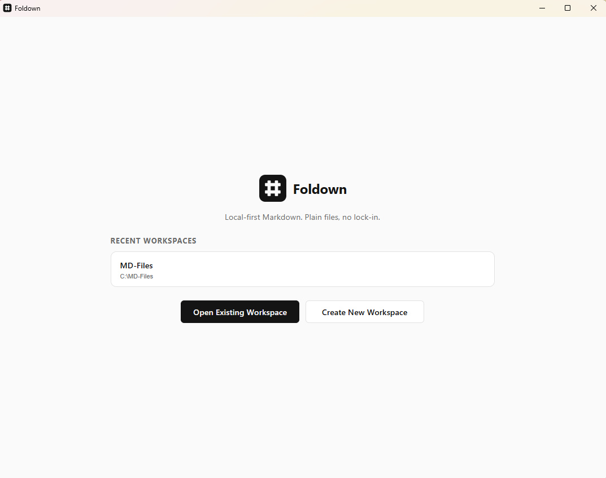
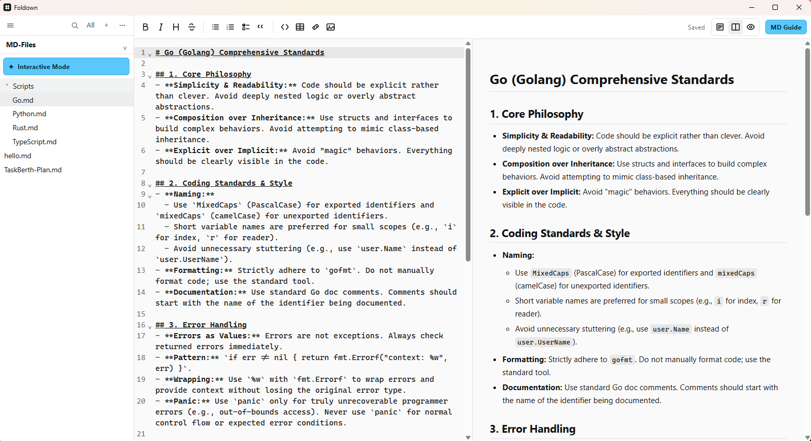
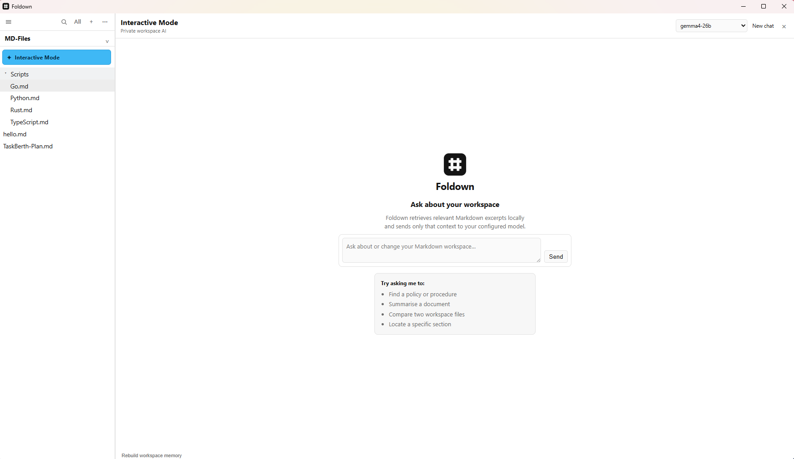
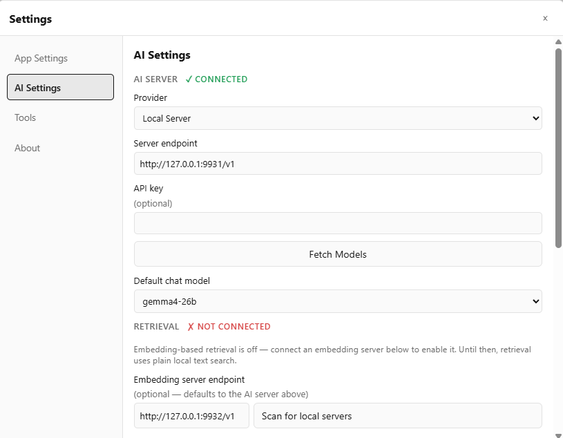
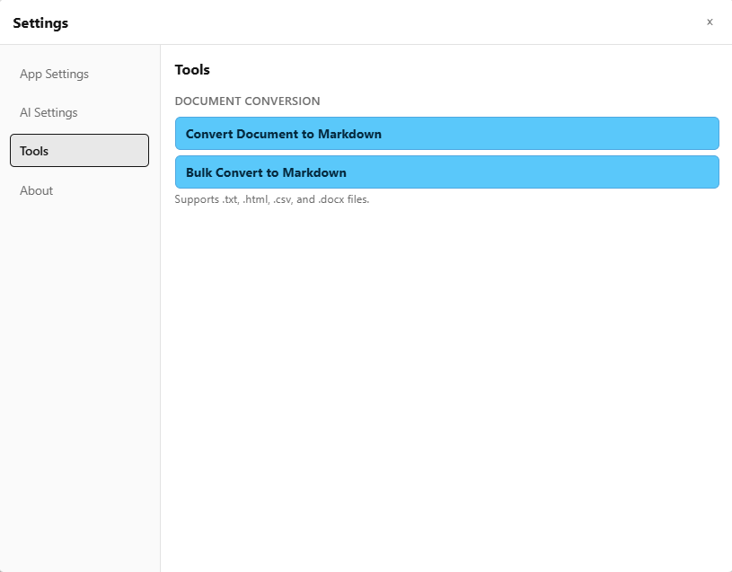

<p align="center">
  
</p>

<p align="center">
  A local-first AI Markdown editor for Windows with workspace search, document conversion, and privacy-focused storage.
</p>

Foldown is a free, open-source Windows Markdown editor for people who want a fast file-based workspace without cloud lock-in. It keeps your notes as ordinary `.md` files on disk, adds full-text search and document conversion, and provides an optional AI workspace assistant that can use local, private-network, or cloud providers.

There is no required account, subscription, built-in telemetry, proprietary document format, or database lock-in. Open the same files in any other Markdown editor whenever you want.

 **Foldown 1.3.0 is the current production release.** Download the installer or standalone Windows executable from the [GitHub Releases page](https://github.com/TheZeekA/foldown/releases/latest).

## Features

- **Local-first Markdown editing** with source, split, and rendered-preview modes
- **AI workspace assistance** with local, OpenAI-compatible, Claude, and Gemini providers
- **Privacy-focused storage** with local settings, indexing, and Windows Credential Manager-backed API keys
- **Workspace search** across your Markdown files with highlighted snippets
- **Document conversion** from TXT, HTML, CSV, and DOCX into Markdown
- **Safe file actions** with workspace containment checks, diffs, confirmations, and Recycle Bin deletion
- **Editor productivity** with document outlines, selection-based AI proposals, and local version history
- **Workspace Insights** with wiki links, backlinks, tags, and broken-link or missing-asset health checks
- **Image assets** with drag-and-drop importing into the workspace `assets` folder and live Preview rendering

## Screenshots

### Welcome screen



### Markdown editor and live preview



### Interactive Mode workspace assistant



### AI provider settings



### Document conversion tools



### Markdown editing

- CodeMirror 6 source editor with Markdown syntax highlighting, line wrapping, code folding, and formatting controls
- Source, split, and rendered-preview modes
- Live GitHub Flavored Markdown preview
- Tables, task lists, strikethrough, links, and fenced code blocks
- YAML frontmatter detection and a collapsible field panel
- Automatic saving with atomic disk writes
- External-change detection with reload or keep-mine choices
- Configurable light, dark, or system theme
- Configurable editor font and font size
- **MD Guide** toolbar button opens a Markdown syntax cheat sheet in its own window, so it can stay open alongside the editor
- Document outline navigation, selection-based AI actions, and local version history
- Drag images into the editor to copy them into `assets/` and insert a Markdown image reference

### Workspace management

- Open any local folder as a workspace
- Start from a recent-workspaces screen instead of automatically reopening the last workspace
- Create a named workspace by choosing its parent location; Foldown creates the folder for you
- Markdown-focused file tree with an optional all-files view
- Create, rename, duplicate, move, and delete files or folders
- Drag files and folders within the workspace tree
- Deleted items go to the Windows Recycle Bin
- Drop a Markdown file onto Foldown or open `.md` files through Windows
- Full-text workspace search with highlighted snippets
- Window size, position, theme, font, and recent-workspace history persist between sessions
- Workspace Insights for wiki links/backlinks, YAML frontmatter tags, and workspace health findings

### Document conversion

Convert individual files or batches into Markdown from:

- Plain text (`.txt`)
- HTML (`.html`, `.htm`)
- CSV (`.csv`)
- Microsoft Word (`.docx`)

### Interactive Mode

Interactive Mode connects Foldown to an AI chat provider — either a local or private-network OpenAI-compatible model server, or a cloud provider's own API — while retrieval itself always runs locally, no matter which provider you choose.

- Choose the active chat provider in **AI Settings**: **Local Server** (any OpenAI-compatible endpoint — llama.cpp, Ollama, LM Studio, etc.), **ChatGPT** (OpenAI), **Claude** (Anthropic), or **Gemini** (Google)
- Switching providers never discards what you typed into another provider's fields — all four are saved together, so you can compare them without re-entering API keys
- Streams chat responses inside the app for every provider
- Each provider's chat model list can be fetched live from that provider's own API
- Local Server's file-action feature parses a text-based JSON contract from the reply; the three cloud providers use each provider's own native tool-calling instead — both paths produce the same create/replace/delete result underneath
- Retrieves only the most relevant workspace excerpts for each request via Foldown's local RAG pipeline (see below), but also gives the model the path of every Markdown file in the workspace — including subfolders — so it can accurately reference or ask about a file even when its content wasn't retrieved
- Shows which workspace files were supplied as context, with clickable citations that jump to the exact passage
- Supports cancelling active requests
- Can create, replace, or delete Markdown files within the active workspace

Creating a brand-new file is validated and applied automatically. Replacing an existing file's content or deleting a file always displays a confirmation card — showing a diff for replacements — before anything on disk changes, and deletes use the Windows Recycle Bin.

Foldown never gives the model unrestricted filesystem access. AI paths must be relative Markdown paths contained within the open workspace. Action responses are validated, path traversal is rejected, and a proposed operation is refused if its target changed unexpectedly.

Each cloud provider's API key is stored in Windows Credential Manager, protected by your Windows login — never in Foldown's own SQLite settings file (see [Privacy considerations](#privacy-considerations)).

### Retrieval (RAG): how Foldown grounds the model in your workspace

Interactive Mode never sends your whole workspace to the model. Instead, Foldown builds and maintains a local retrieval index and selects only the most relevant material for each question — a retrieval-augmented generation (RAG) pipeline that runs entirely on your machine, regardless of which chat provider you choose.

1. **Chunking and indexing.** Every Markdown file is split into heading-scoped chunks and stored in a local SQLite index. Indexing is incremental: a SHA-256 content hash means unchanged files are never re-chunked or re-embedded on a later sync — only new, changed, or deleted files touch the index.
2. **Candidate retrieval.** For each question, Foldown first gathers a wider set of candidate chunks (20 by default) — using SQLite FTS5 full-text search by default, or vector similarity if you've configured an embedding model (see below).
3. **Optional reranking.** If reranking is enabled, those candidates are re-scored by a dedicated reranker model for closer semantic relevance before the final selection.
4. **Final selection.** The best-scoring chunks (8 by default) are trimmed to a character budget (12,000 characters by default) and inserted into the prompt as workspace context, alongside the complete list of every Markdown file path in the workspace so the model can still reference files it wasn't given an excerpt for.

None of this consumes chat-provider tokens — chunking, hashing, and indexing all happen locally. Candidate count, final count, and the character budget are all configurable in **AI Settings**.

#### Embedding option

By default, retrieval uses plain local full-text search (SQLite FTS5) — no embedding server required. If you configure an **embedding model**, Foldown instead computes and caches vector embeddings for each chunk (and each query) and ranks candidates by cosine similarity, which typically finds semantically related content that full-text search alone would miss — paraphrases, synonyms, and related concepts that don't share exact keywords.

- Point Foldown at any OpenAI-compatible `/embeddings` endpoint — by default the same server as Local Server chat, or a separate dedicated embedding server (for example, a Nomic embedding model running on its own port).
- Configurable **document** and **query** embedding prefixes (defaulting to Nomic's own `search_document: ` / `search_query: ` convention) are prepended before embedding, matching how instruction-tuned embedding models expect to be called.
- Embeddings are cached in SQLite per model and per exact input text, so re-syncing an unchanged chunk never re-embeds it.
- If the embedding server becomes unreachable, or a cached embedding's dimension no longer matches what the server currently returns (for example, you pointed the same model name at a different, differently-sized server), retrieval automatically falls back to full-text search rather than failing outright or silently returning nonsense results.
- Clearing the embedding model field turns embedding-based retrieval off again; nothing already cached is deleted, retrieval simply falls back to full-text search.

#### Reranker option

Reranking is a second, optional scoring pass applied after candidate retrieval, using a dedicated cross-encoder reranker model (for example, BGE) that scores each candidate chunk directly against your exact question — typically more accurate than embedding similarity or full-text ranking alone, at the cost of one extra request per question.

- Enable reranking and point it at any TEI/Jina-compatible `/rerank` endpoint — the same shape llama.cpp's `--reranking` flag serves — by default the same server as Local Server chat, or a separate dedicated reranker server.
- Toggle reranking on or off at any time; turning it off simply skips the extra scoring pass and uses the candidates' original full-text or embedding-similarity order.
- If the reranker is unreachable or returns something Foldown doesn't understand, retrieval automatically falls back to the unreranked candidate order — a broken reranker never blocks or breaks a chat request.
- Embedding-based retrieval and reranking are independent: you can enable either on its own, both together, or neither (plain full-text search).

## Install and run

Foldown currently targets 64-bit Windows.

1. Download the latest Windows installer or standalone executable from the [GitHub Releases page](https://github.com/TheZeekA/foldown/releases/latest). The installer upgrades an existing per-machine Foldown installation in place under `C:\Program Files\Foldown`.
2. Open a recent workspace, open an existing folder, or create a named workspace in a parent location you choose.
3. Select a file from the left sidebar to begin editing.

Foldown uses Microsoft Edge WebView2, which is included with current Windows 10 and Windows 11 installations.

## How to use Foldown

### Open a workspace

Foldown starts on the welcome screen and never automatically reopens the previous workspace. Select an available recent workspace, choose **Open Existing Workspace…**, or choose **Create New Workspace**, select a parent location, and enter the new folder name. Missing recent folders can be removed from the list. To change workspaces later, use the workspace control in the sidebar header.

The selected folder remains the security boundary for normal file operations and Interactive Mode. Foldown does not move your Markdown content into its settings database.

### Edit and preview Markdown

Select a Markdown file in the sidebar and type in the editor. Changes save automatically after a short delay. Use the editor toolbar to format text and switch between source, split, and preview modes.

If another program changes the open file, Foldown warns you instead of silently overwriting it. You can reload the disk version or keep your current version.

### Manage files

Use the **+** button or right-click the workspace tree to create files and folders. The context menu also provides rename, duplicate, and delete actions. Files can be dragged between folders in the tree.

New Markdown filenames receive a `.md` extension automatically when one is not supplied.

### Search the workspace

Select the search icon in the sidebar header, enter a query, and choose a result. Foldown opens the matching file and jumps to the relevant text.

### Convert documents

1. Open **Settings**.
2. Select **Tools**, then find **Document conversion**.
3. Choose **Convert Document to Markdown…** for one file or **Bulk Convert to Markdown…** for several files.
4. Select the output file or destination folder.

Original source files are left unchanged.

### Settings

Select the Settings button in the sidebar header to open **App Settings**. The settings workspace has four pages:

- **App Settings** for the application theme and editor font preferences.
- **AI Settings** for choosing the active chat provider (Local Server, ChatGPT, Claude, or Gemini) and its credentials and model, plus the shared local retrieval settings — embedding model and reranker options — that apply no matter which provider is active.
- **Tools** for single-file and bulk document conversion to Markdown.
- **About** for Foldown information.

If Interactive Mode is selected before an AI server and chat model are configured, Foldown displays a warning. Choose **Open Settings** in that warning to go directly to **AI Settings**.

The About page shows the version of the running application dynamically, lists **Zeeka Limited** as the developer, and provides a contact link to [support@zeeka.nz](mailto:support@zeeka.nz).

## Configure Interactive Mode

Interactive Mode can talk to a local or private-network OpenAI-compatible server, or directly to ChatGPT, Claude, or Gemini's own cloud API. Retrieval (embeddings and reranking) is configured separately from the chat provider and always stays local.

### Choose a chat provider

1. Open **Settings** in Foldown, then **AI Settings**.
2. Choose a **Provider**: **Local Server**, **ChatGPT**, **Claude**, or **Gemini**.
3. Configure that provider:
   - **Local Server** — start your model server, then enter its OpenAI-compatible base URL (for example `http://localhost:11434/v1`) and, if it requires one, an API key.
   - **ChatGPT / Claude / Gemini** — enter that provider's API key. The endpoint is fixed to the provider's own API and isn't user-editable.
4. Select **Fetch Models** to list the models that provider currently makes available, then choose a default chat model.
5. Select **Save AI Configuration**.

Switching the **Provider** selector never discards what you've typed into another provider — all four providers' settings are saved together, so you can compare ChatGPT, Claude, Gemini, and a local model without re-entering API keys each time you switch.

If no provider and chat model are configured, selecting **Interactive Mode** displays **No AI Server Configured** with a shortcut to Settings.

### Configure retrieval (embeddings and reranking)

These settings live on the same **AI Settings** page, below the provider fields, and apply no matter which chat provider is active — see [Retrieval (RAG)](#retrieval-rag-how-foldown-grounds-the-model-in-your-workspace) above for how they fit together.

1. To enable embedding-based retrieval, enter an **embedding server endpoint** (defaults to Local Server's endpoint if left blank) and select **Fetch Models** to confirm a model is discovered.
2. Adjust the document and query embedding prefixes if your embedding model expects different instruction prefixes than Nomic's default convention.
3. Adjust **Candidate chunks considered** and **Final chunks sent to the model** to trade off retrieval quality against prompt size.
4. To enable reranking, check **Enable reranking**, enter a **reranker server endpoint** (defaults to Local Server's endpoint if left blank), and enter the reranker's **model** name.

Leave the embedding model unset and reranking disabled to use plain local full-text search, with no network calls beyond the chat request itself.

### Chat with the workspace

1. Open a Markdown workspace.
2. Select **Interactive Mode** above the workspace file list.
3. Choose the active model from the selector in the Interactive Mode header if you want to override the saved default.
4. Ask a question or request a workspace change.

Examples:

```text
Summarize the decisions in this workspace.
```

```text
Add a section titled Next Steps to Project Plan.md.
```

```text
Create meeting-notes.md with a short agenda template.
```

For create and edit requests, the model must return complete file content in a structured action. Foldown hides that machine-readable action from the conversation and validates it. Creating a brand-new file writes it immediately and refreshes the workspace tree. Replacing an existing file's content shows a diff and asks for confirmation before anything on disk changes.

For delete requests, Foldown shows the target file and asks **Are you sure?** Nothing is deleted until you confirm.

### Privacy considerations

- Markdown files remain on disk as plain files.
- The workspace knowledge index, embedding cache, and settings are stored locally in SQLite.
- If you configure an embedding model, indexed chunk text (not full files) is sent to the embedding server endpoint — by default the same server as chat, or a separate endpoint if you set one in AI Settings. If you enable reranking, the same candidate chunk text is also sent to the configured reranker endpoint.
- Only the most relevant excerpts (by default at most eight chunks and 12,000 characters — configurable in AI Settings) are added to each AI prompt. Incremental hashing and indexing happen locally and do not consume model tokens.
- Every chat request also includes the relative path of every Markdown file in the workspace — file names and folder structure, not file content — so the model can accurately reference files it wasn't given an excerpt for.
- Chat messages, the workspace's file paths, and retrieved excerpts are sent to the server endpoint you configure.
- Configuring a network endpoint (chat, embedding, or reranker) means relevant workspace content, along with the full list of file paths, leaves the local computer and travels to that server. Nothing is sent anywhere unless you configure an endpoint for it.
- Choosing ChatGPT, Claude, or Gemini as the chat provider is inherently non-local: your chat messages, the workspace's file paths, and retrieved excerpts are sent to that provider's cloud API over the internet, the same content Local Server would otherwise receive at whatever endpoint you configured. The embedding and reranking pipeline always runs against your locally-configured server regardless of which chat provider you choose — RAG itself never leaves the machine.
- Each provider's API key is stored in Windows Credential Manager (protected by your Windows login), never in Foldown's own SQLite settings file.
- Foldown contacts the server to discover models when you select **Fetch Models** or open Interactive Mode. Model discovery sends no workspace content; excerpts are sent only when you submit a chat request.
- Conversation history is kept only for the current app session and resets when the workspace changes.
- HTTP redirects are disabled for AI requests so workspace content cannot be silently redirected to another host.

## Frequently asked questions

### Is Foldown free?

Yes. Foldown is open source under the [MIT License](LICENSE.md), with attribution to Zeeka Ltd / Teddy Jones required by the license.

### Does Foldown work offline?

The Markdown editor, workspace management, search, and local storage work offline. AI features require access to the provider endpoint you configure. Foldown has no built-in updater or background connection to a Zeeka server; new versions are published through GitHub Releases.

### Where are my Markdown files stored?

Foldown edits the files in the workspace folder you choose. Your notes are not copied into a proprietary document database.

### Can I use a local AI model?

Yes. Interactive Mode supports local or private-network OpenAI-compatible servers, including Ollama, LM Studio, and llama.cpp-compatible endpoints.

### Does Foldown require an account?

No. Foldown does not require an account or subscription. Cloud AI providers may have their own account and API-key requirements.

### Is Foldown an alternative to Obsidian or Typora?

Foldown is a file-based Windows Markdown editor with optional AI assistance, full-text workspace search, and document conversion. It may suit you if you want your notes to remain ordinary Markdown files and prefer a local-first desktop workflow.

## Development

### Prerequisites

- Node.js 20 or newer and npm
- Stable Rust toolchain
- Microsoft Visual Studio C++ Build Tools with the **Desktop development with C++** workload
- Microsoft Edge WebView2 Runtime

See the [Tauri Windows prerequisites guide](https://v2.tauri.app/start/prerequisites/) for the complete Windows toolchain setup.

### Run in development

```bash
npm install
npm run tauri dev
```

The first launch takes longer because Rust dependencies must be compiled. Later builds reuse the compiled artifacts while Vite provides frontend hot reload.

### Run tests

Frontend tests:

```bash
npm test
```

Rust tests:

```bash
cd src-tauri
cargo test
```

The suites cover frontmatter parsing, AI action handling, workspace containment, atomic filesystem operations, settings, search indexing, document conversion, Markdown context chunking, model responses, and retrieval behavior.

### Build a Windows release

```bash
npm run tauri build
```

Build outputs include:

```text
src-tauri/target/release/foldown.exe
src-tauri/target/release/bundle/nsis/Foldown_<version>_x64-setup.exe
src-tauri/target/release/bundle/msi/Foldown_<version>_x64_en-US.msi
```

Official Windows release artifacts are published on the [GitHub Releases page](https://github.com/TheZeekA/foldown/releases). Downloaded EXEs are currently unsigned, so Windows may display a SmartScreen warning. Users should download releases only from this repository.

## Technology

- [Tauri 2](https://v2.tauri.app/) and Rust for the native application, filesystem boundary, AI networking, and document conversion
- React, TypeScript, and Vite for the interface
- CodeMirror 6 for Markdown editing
- unified, remark-gfm, rehype-sanitize, and rehype-stringify for safe preview rendering
- Zustand for frontend state
- SQLite through `rusqlite` for settings, full-text search, workspace retrieval, and embedding caching
- `reqwest` with Rustls for AI-server and cloud-provider communication
- The `windows` crate for Windows Credential Manager-backed cloud provider API key storage

## Project structure

```text
foldown/
├── src-tauri/                 Rust/Tauri backend
│   └── src/
│       ├── ai/                Local model client, retrieval, actions, and Tauri commands
│       │   └── providers/     ChatGPT, Claude, and Gemini clients (native tool-calling)
│       ├── commands/          Application command boundary
│       ├── convert/           Document-to-Markdown conversion
│       ├── fs/                Workspace tree, safe operations, and watching
│       ├── native/            Windows-specific integrations, incl. Credential Manager
│       ├── search/            Full-text workspace search
│       └── settings/          SQLite-backed application settings
├── src/                       React/TypeScript frontend
│   ├── components/            Editor, preview, sidebar, search, and settings
│   ├── editor/                CodeMirror commands and frontmatter parsing
│   ├── features/
│   │   ├── InteractiveMode/   AI chat and operation-confirmation interface
│   │   └── MdGuide/           Markdown cheat sheet (opens in its own window)
│   ├── lib/                   Types, paths, themes, provider config, and Tauri API wrappers
│   ├── stores/                Zustand application state
│   └── styles/                Shared visual theme
└── README.md
```

## Status

 Foldown 1.3.0 is the current production release. Interactive Mode supports local and private-network OpenAI-compatible servers alongside direct integrations with ChatGPT, Claude, and Gemini. Retrieval (chunking, embedding, and reranking) always runs locally regardless of which chat provider is active. Updates are published through GitHub Releases.

## License and assets

Foldown is available under the [MIT License](LICENSE.md). Foldown's icon and wordmark source assets are stored at the repository root, with generated application icons under `src-tauri/icons/`.
